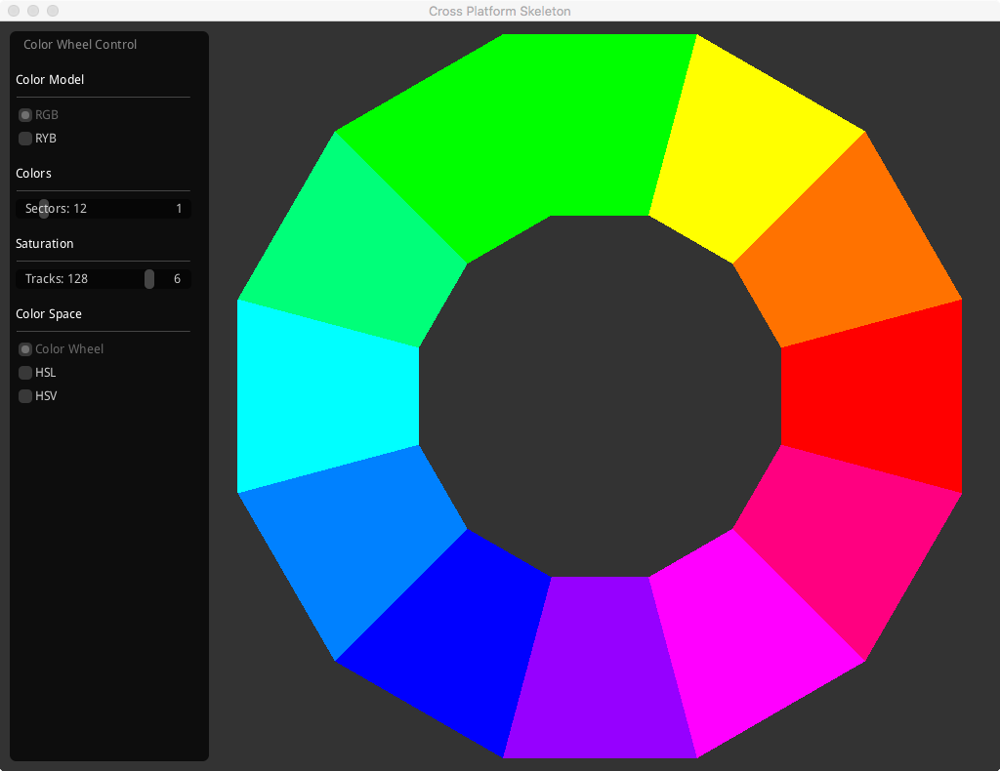
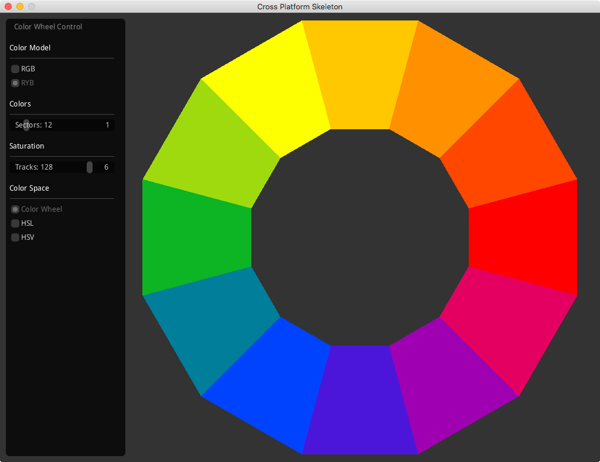
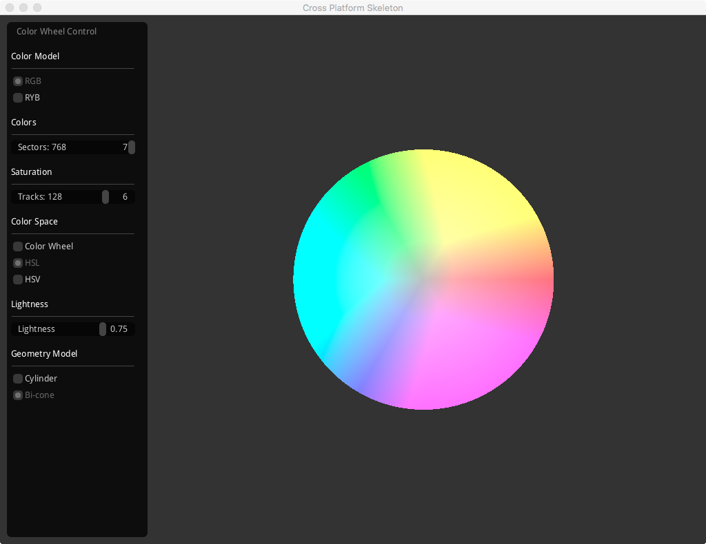
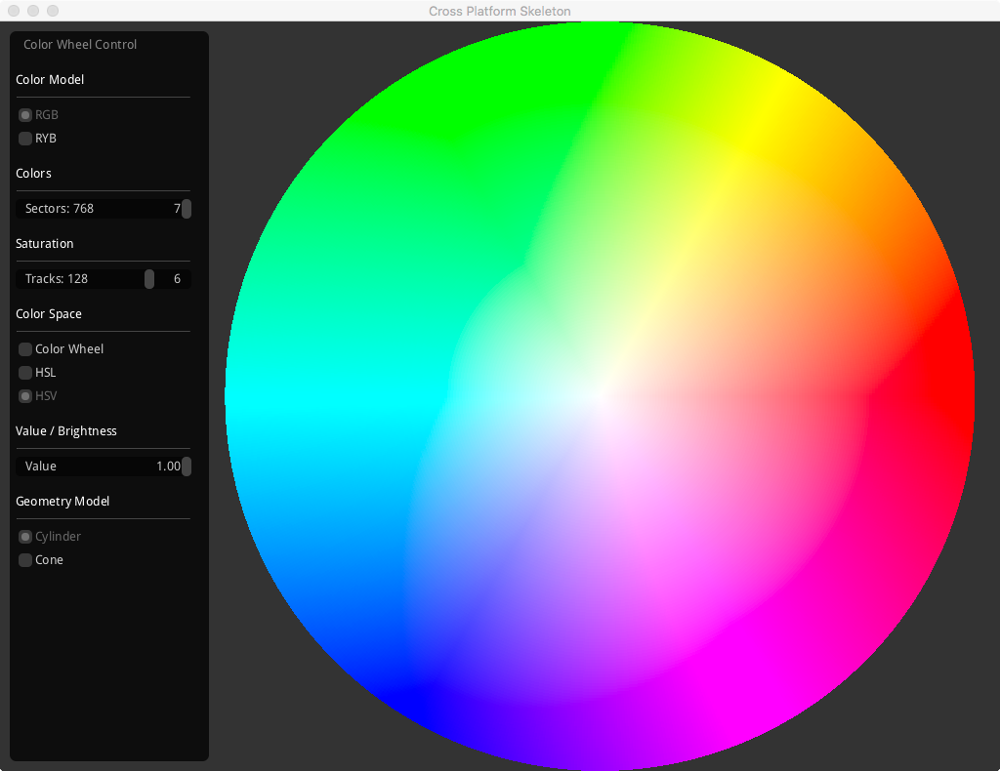
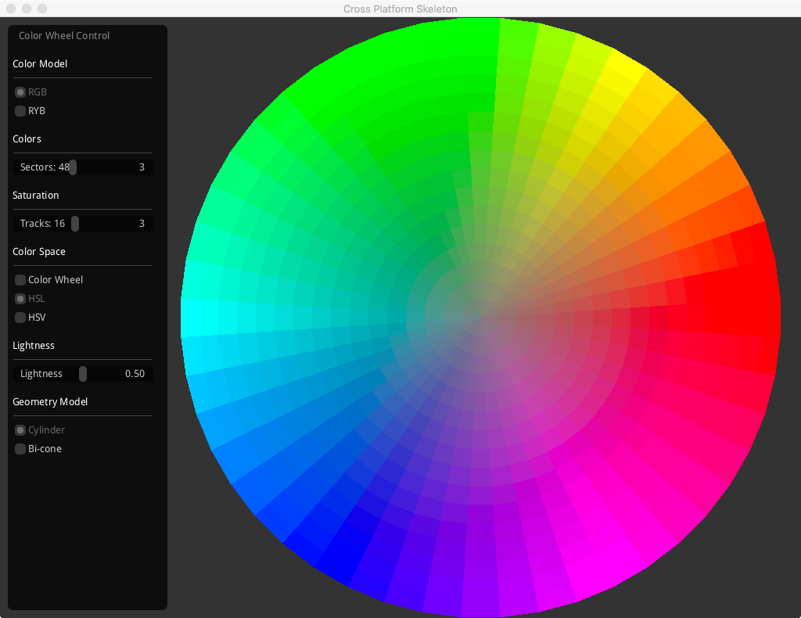

# ColorWheel
Experimental project for visualizing different color spaces. Also, some experimental C++11-style with OpenGL.

## Color Picking and Color Space Visualization
This program stems from an idea of building _a better color picker_. A fair amount of time was spent reading graphics literature regarding, and related to, color pickers and color space representations. Some color space representations work better than others for humans vs machines; some color spaces make more, or less, sense depending on how an individual is thinking about color; and some color spaces appear more natural when skewed.
There was some intention of being able to transition between different color spaces freely depending on a user’s desire or need. There are several controls that manipulate the primary colors, shape, and granularity of the color space visualization on-the-fly.

### RGB, RYB, Additive, and Subtractive Color Models
The program has two main color models either an RGB (Additive) or RYB (Subtractive) primary color model.

**RGB** is the color system most native to machines and displays. Different colors of light are additively mixed together to form the different colors of the spectrum. Additive RGB is a color theory is based on the scientific study of light.

**RYB** (Red, Yellow, Blue) is an older standard for primary colors based on paint pigments. As pigments are mixed, the amount of reflected colored light is reduced. Therefore, colors are mixed through a subtractive process. RYB is a color theory that predates modern scientific study, but is still taught and used in art, design, and painting. _NOTE:_ This program’s version of RYB is, likely, not an accurate representation of the actual physics of subtractive color mixing. I added RYB for fun, and just to see how it would look. It would be nice to verify and/or correct the implementation in the future.

**CMY** (Cyan, Magenta, Yellow) are the modern primary colors used for subtractive color mixing. For example, color printing. This program does not support CMY or CMYK at this time. Those color systems would be a future feature.

### Color Wheel, HSL, and HSV
One mode of the program displays a simple one-dimensional color space as a color wheel. The two alternate modes display a two-dimensional plane, or slice, of a three-dimensional color space.
In all three modes, hue is represented by the angle of given color. In both HSL and HSV, Saturation is is zero at the center of the disc (origin of the plane) and 100% at the out most edge of the disc. The Lightness and Value axes run perpendicular to the color plane. That is, Lightness and Value move in a direction toward and away from the screen.

**Color Wheel** a _true classic_. Great for visualizing how basic color hues relate to one another.

**HSL** (Hue, Saturation, and Lightness) a three-dimensional color space used to represent the RGB color model. Most commonly, this color space is represented as a cylinder, although the program can more accurately represent it as a bi-cone. The Lightness attribute may be thought of as: the amount of tint or shade; or the amount of added white or black. As Lightness moves up through the color space you’re “adding white” or creating “tints” of the colors. As Lightness moves down through the color space you’re “adding black” or creating “shades” of the colors. The most pure hues may be found at the center, with no additional white or black.

**HSV** (Hue, Saturation, and Value) a three-dimensional color space used to represent the RGB color model. Most commonly, this color space is represented as a cylinder, although the program can more accurately represent it as a cone. The Value attribute may be thought of as the brightness of the color. At the center of the disc, 0% saturation, Value ranges from black to white. As the Value attribute is adjusted up, the relative brightness of each hue and saturation increases. The most pure hues are found at maximum brightness.

### Tessellation
**Color Hues** (sectors) The active color model determines the initial three primary colors. Additional color hues are determined by number of sectors in the wheel or disc. More sectors causes more hues to be generated.

**Saturation Granularity** (tracks) By default the number of tracks is very granular. That is, there’s a large swath possible saturation values. When in the HSL or HSV modes you may reduce the number of tracks to produce a less granular gradient of saturation values for each hue.

#### Notes
I stopped working on the program before I was completely satisfied with the possible variations in visualizations. The GUI was left very programmer centric (NOT user friendly). This also means, I never arrived at the point of even adding the GUI to actually provide color selection.

If I were to pick up where I left off, I’d:

1. focus on presenting a three-dimensional perspective of the color spaces; where appropriate.
2. likely, include some sort of linear gradient slider control similar to how many other color pickers work.
3. add actual color picking functionality.
4. add features to support advanced color picking, like: complimentary colors.
5. support pasting selected colors to the system clipboard in few different formats.
6. support reading colors from the clipboard in a few different formats.
7. figure out where to find actual useful technical information about CIE-Lab color space, and include support for it.

## OpenGL with C++11-style Wrappings
Since this was manly an experimental project I played with some language features and libraries that I might not otherwise. There are many things about the chosen tools I like, and a few things I’d do differently in the future. There is code or ideas I would salvage from this project.

- **SDL2** was used for the main application framework. I would use SDL2 again, as it seems reasonable. The API is straight forward and likable. The internal code is a mess. Debugging SDL code is unpleasant, but not impossible. The largest disadvantage using the SDL in a modern project would be that its error handling methods are completely incongruent with return codes or C++ exception handling. The API _only_ returns text based error messages.
- **OpenGL 3.2** was chosen, as it most closely matched the OpenGL ES 2.0 spec. I was trying to keep anything I wrote, mostly portable to mobile devices. I started playing with creating really small wrapper objects for resources and small wrapper functions that would add type safety. Creating of the wrapper functions got-out-of-hand. The results are nice for calling code, but the manual overhead to produce and maintain the inline wrapper functions is too heavy. I like the results, I just didn’t have time to commit. In the future it would be better to just create an automatic parser that could read the OpenGL header and generate the wrapper code. _That_, would be an excellent future project. I was learning a ton about how to make the OpenGL library feel much more modern. I’d like to write more about this, but maybe at a later time.
- **GLM** was used for mathematical vector types. While, like everyone, I’ve written my own vector math libraries, I thought I’d give this one a try. Several programmer I respect were using, or talking about it. It’s pretty good. I appreciate that the author has very specific, and stated goals describing how, and what, the library does. There were some things I didn’t like. Although, it looks like those things may have already been addressed in the latest version. Seems reasonable. I would use it again.
- **Adrien Herubel’s imgui (as pulled from the recast library)** was used for the GUI. Straight forward. Gets the job done.

## Building
I used brew for the GLM, and SDL2 libraries. You may be able to simply do this:

`brew install glm`

`brew install sdl2`

The build and run from Xcode.

### Boost Software License - Version 1.0
- See accompanying file LICENSE\_1\_0.txt or copy at [http://www.boost.org/LICENSE\_1\_0.txt][1]

#### The Boost License Design Requirements:
- Must be simple to read and understand.
- Must grant permission without fee to copy, use and modify the software for any use (commercial and non-commercial).
- Must require that the license appear with all copies [including redistributions] of the software source code.
- Must not require that the license appear with executables or other binary uses of the library.
- Must not require that the source code be available for execution or other binary uses of the library.

[1]:	http://www.boost.org/LICENSE_1_0.txt